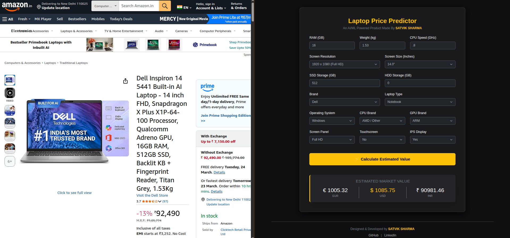

# 💻 AI-Powered Laptop Price Predictor


A full-stack Machine Learning web application that accurately predicts the market value of laptops based on their hardware specifications. 

<div align="center">
  
</div>

### 🚀 **[Live Demo: Try the Web App Here](https://satvik-sharma-laptop-price-predictor.onrender.com)**
*(Note: The application is hosted on Render's free tier. It may take 50-60 seconds to wake up if it hasn't been used recently!)*

---

## 📌 Project Overview
The laptop market is highly saturated with complex naming conventions and varying hardware configurations, making it difficult for consumers to know if they are getting a fair price. This project solves that problem by leveraging an **XGBoost Regression model** trained on historical pricing data to provide instant, data-driven price estimations.

The project bridges the gap between raw data science and software engineering by wrapping the predictive model in a lightweight **Flask REST API** and serving it through a responsive, modern web interface.

## ✨ Key Features
* **High-Accuracy ML Model:** Utilizes a heavily tuned XGBoost algorithm with cross-validation and log-transformed target variables for robust pricing predictions.
* **Dynamic Feature Engineering:** The backend automatically calculates complex metrics (like Pixels Per Inch) dynamically from user-friendly inputs (Screen Size and Resolution).
* **Multi-Currency Conversion:** Instantly displays the predicted market value in EUR (€), USD ($), and INR (₹).
* **Modern UI/UX:** Features a sleek dark theme with high-contrast accents, built with Bootstrap 5. 
* **Stateful Forms:** Implements Jinja2 templating to retain user inputs after submission, allowing for rapid A/B testing of hardware configurations.

---

## 🛠️ Technology Stack
* **Data Science & ML:** Python, Pandas, NumPy, Scikit-Learn, XGBoost
* **Web Backend:** Flask, Gunicorn (WSGI)
* **Frontend:** HTML5, CSS3, Bootstrap 5, Jinja2
* **Deployment & CI/CD:** Render, Git/GitHub

---

## 📂 Architecture & Project Structure
```text
laptop-price-predictor/
│
├── app.py                 # Core Flask application and API routing (Backend)
├── training_notebook.ipynb# Data exploration, preprocessing, and model training
├── laptop_data.csv        # Cleaned dataset used for model training
├── model.pkl              # Serialized XGBoost Regressor
├── columns.pkl            # Encoded feature columns mapping
├── requirements.txt       # Production dependencies
└── templates/
    └── index.html         # Frontend user interface
